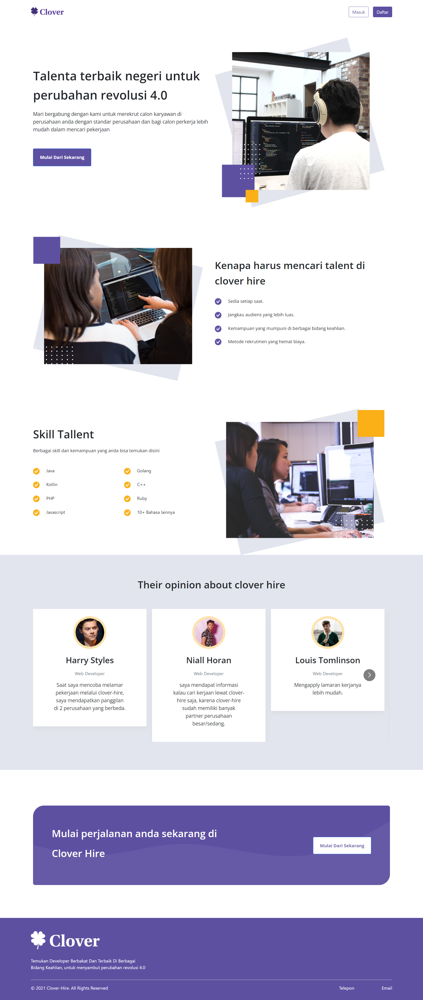
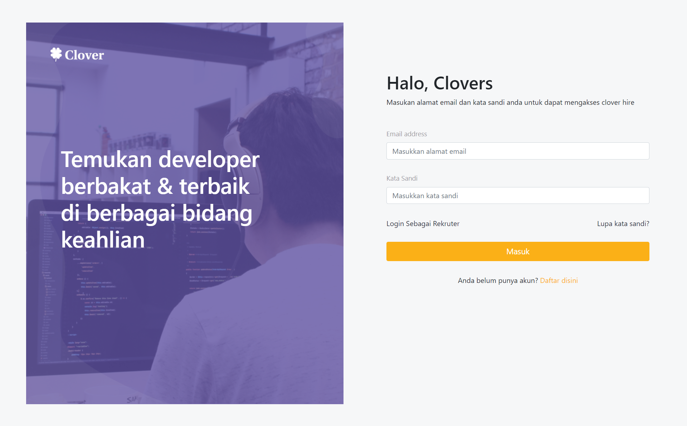
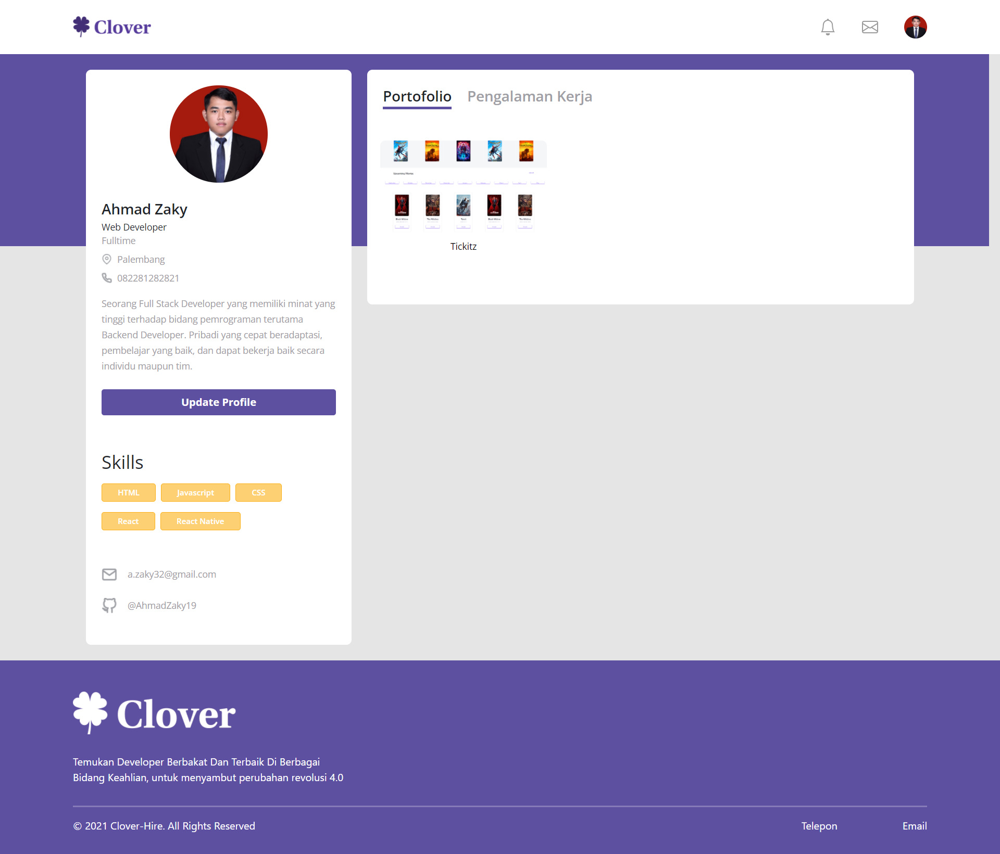
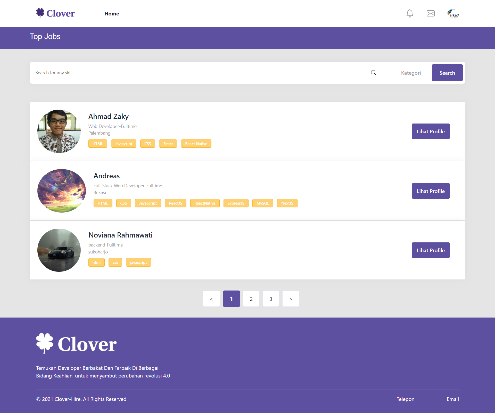
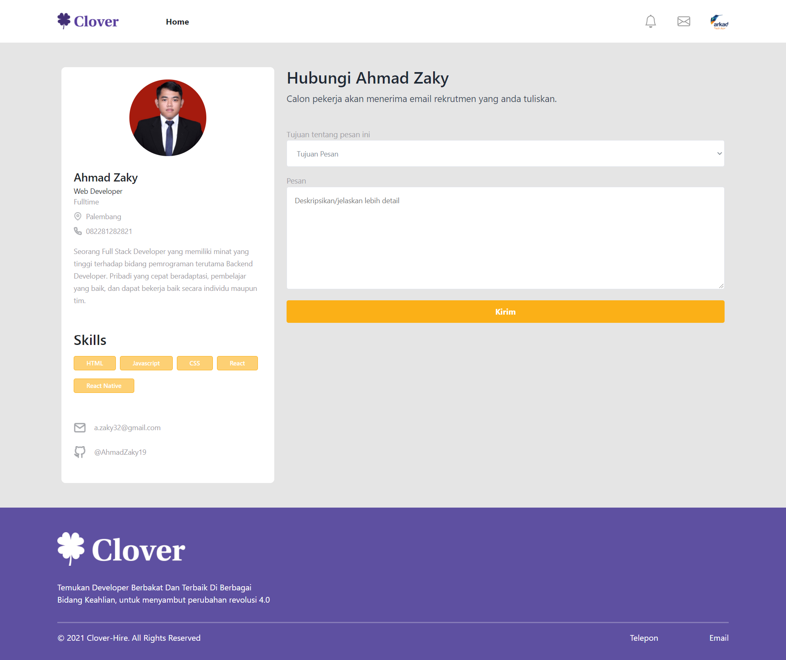

# Clover Hire

<div align="center">
    
</div>

## Contents

- [Description](#description)
- [Installation](#installation-for-development)
- [Screenshoots](#screenshoots)
- [Demo Project](#demo-project)
- [Backend Repository](#backend-repository)

## Description

**Clover Hire** is a simple job website that can facilitating company to recruit talented programmer based on skills that company needed. It also provide programmer to show their portofolio so they can get recruited by some company.

## Installation

Clover hire requires [Node.js](https://nodejs.org/) v12+ to run.

Install the dependencies and devDependencies and start the server.

```sh
cd clover-frontend
npm i
node app
```

## Screenshoots

<div align="center">
    
    
    
    
    
</div>

## Demo Project

For the website you can try it in [[here](https://clover-hire.netlify.app)]

## Backend Repository

For the backend repository, you can check it in [[here](https://github.com/AhmadZaky19/clover-backend)]
